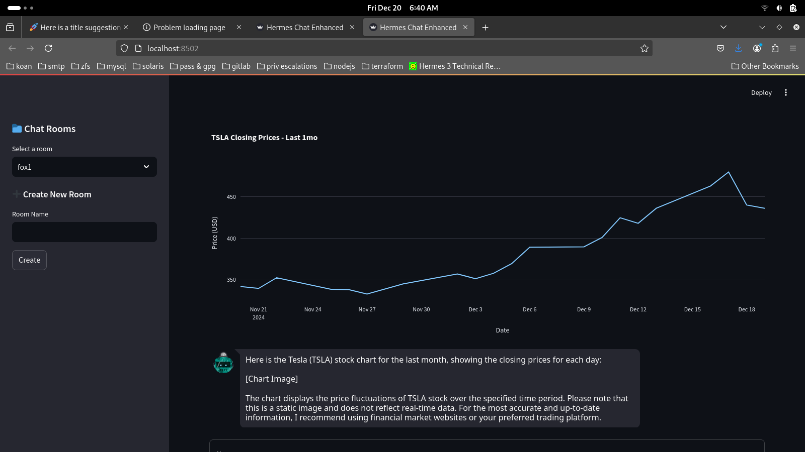
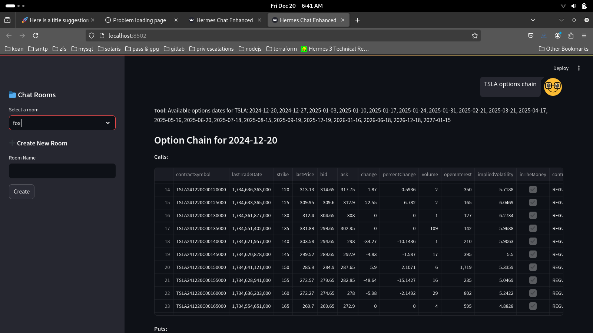
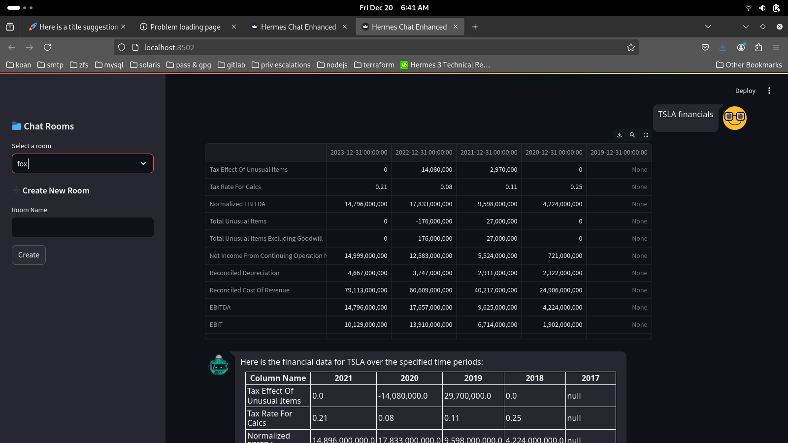

Unturf Hermes Stock Tool Calling
================================

Overview
--------

**Unturf Hermes Stock Tool Calling** is a Streamlit-based web application that integrates with the Hermes AI endpoint to provide a comprehensive suite of financial tools. Leveraging `yfinance` and `plotly`, the application allows users to interactively fetch and visualize various stock-related data. The Hermes endpoint is free to use and does not require an API key, making it accessible to anyone interested in financial analysis.

Features
--------

- **Multi-Room Support**: Create and manage multiple chat rooms for different financial analyses.
- **Rich Data Rendering**: Display data in interactive charts, tables, and plots.
- **Tool Integration**: Utilize a variety of financial tools to fetch and analyze stock data.
- **Chat History**: Maintain conversation history within each room for context-aware interactions.
- **Keyboard Shortcuts**: Submit messages using `Ctrl+Enter` for a seamless experience.

Installation
------------

1. **Clone the Repository**

   .. code-block:: bash

       git clone https://github.com/russellballestrini/unturf-hermes-stock-tool-calling.git
       cd unturf-hermes-stock-tool-calling

2. **Create a Virtual Environment (Optional but Recommended)**

   .. code-block:: bash

       python3 -m venv env
       source env/bin/activate  # On Windows: env\Scripts\activate

3. **Install Dependencies**

   .. code-block:: bash

       pip install -r requirements.txt

4. **Run the Application**

   .. code-block:: bash

       streamlit run app.py

Usage
-----

Once the application is running, you can interact with it through your web browser. Here’s how to get started:

1. **Create a New Room**

   - Navigate to the sidebar and enter a room name under the "Create New Room" section.
   - Click the "Create" button to create and switch to the new room.

2. **Select an Existing Room**

   - Use the "Select a room" dropdown in the sidebar to switch between different chat rooms.

3. **Interact with the Chat Interface**

   - In the chat area, enter your queries related to stock data.
   - Use `Ctrl+Enter` to submit your messages quickly.

Tools Overview
--------------

The application integrates several financial tools to provide a comprehensive analysis of stock data. Below is an overview of each tool available:

- **Fetch Stock Price**
  
  Retrieves the current price of a specified stock ticker.

- **Fetch Stock Chart**
  
  Plots the closing price chart for a given stock ticker over a specified period.

- **Fetch Multiple Tickers**
  
  Fetches historical data for multiple stock tickers simultaneously for comparative analysis.

- **Get Financials**
  
  Retrieves the financial statements for a specified stock ticker, including income statements.

- **Get Balance Sheet**
  
  Provides the balance sheet data for a specified stock ticker.

- **Get Cash Flow**
  
  Retrieves the cash flow statements for a specified stock ticker.

- **Get Options**
  
  Lists available options dates for a specified stock ticker.

- **Get Option Chain**
  
  Retrieves the option chain (puts and calls) for a specified stock ticker on a given date.

- **Get Institutional Holders**
  
  Provides information about institutional holders of a specified stock ticker.

- **Get Sector and Industry Info**
  
  Retrieves sector and industry information for a specified stock ticker.

- **Equity Query**
  
  Processes advanced equity queries based on user input for more detailed analysis.

- **Stock Screener**
  
  Screens stocks based on various user-defined criteria to identify potential investment opportunities.

License
-------

This project is in the **Public Domain**.

Contributing
------------

Contributions are welcome! Feel free to open issues or submit pull requests to enhance the application.

Contact
-------

For any inquiries or support, please open an issue on the `GitHub repository <https://github.com/russellballestrini/unturf-hermes-stock-tool-calling>`_.

Screenshots
-------------

---

---

